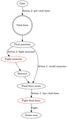
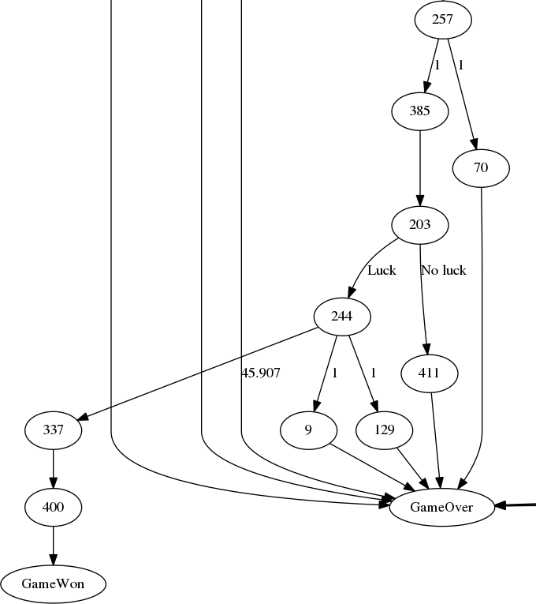
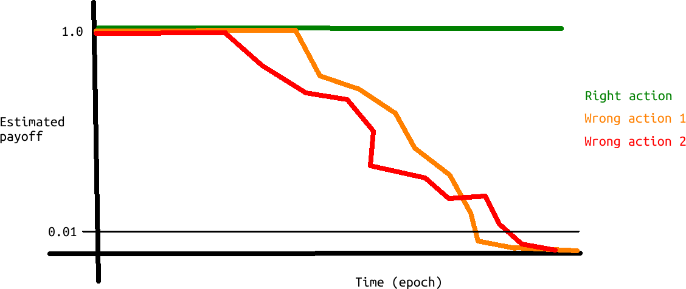
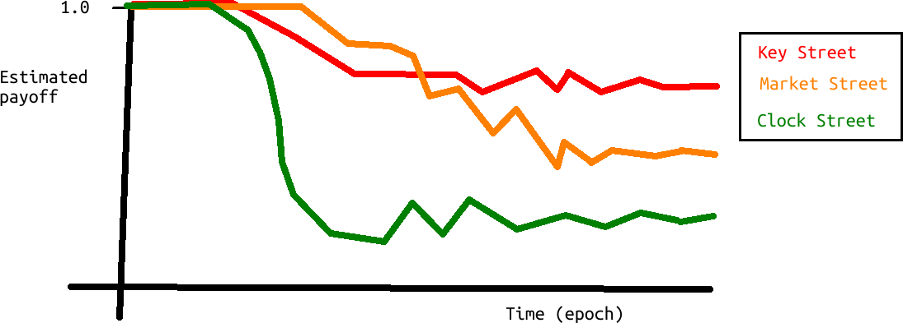
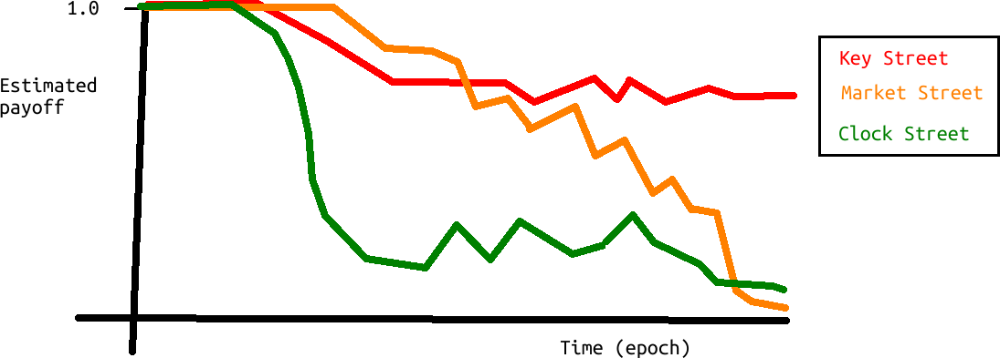
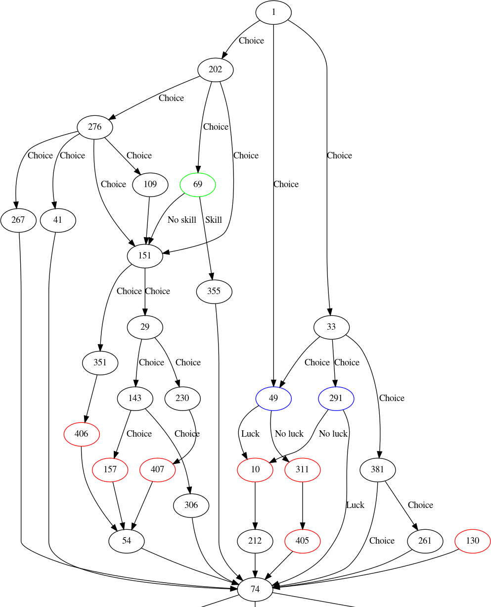

# City of Thieves solved

## Abstract

City of Thieves is a text adventure in the form of a book.
To beat it, a player has to make the right choices, in a stochastic environment.
The optimal strategy to beat this game is unknown,
yet according to author the effect of stochasticity is low.
Here I show the optimal strategy to beat this game
for different amounts of luck involved.
[prime result here].

## Introduction

> The one true way involves a minimum of risk and any player, 
> no matter how weak on initial dice rolls, should be able to get through fairly easily. 
>
> Ian Livingstone

### Adventure books

In the 1980's, before the era of computing, adventure books
allowed the reader to partake a fictional adventure.
Adventure books consisted of hundreds of short chapters in
a random order. The reader starts at chapter 1 and is asked
to do one of multiple actions. Each action takes the player
to a next chapter. The player ultimately completes the game
or dies.

### City of Thieves

> Cover of the first edition of 'City of Thieves'

City of Thieves is a an adventure book written by Ian Livingstone in 1984,
in which the player ventures to the castle of the protagonist,
after having visited a certain person in a medieval city,
the titular 'City of Thieves'. 

### Premise

In summary, with the game there are three characteristics
the fictional character can have,
which are determined from dice rolls.
According to the quote of the author at the start of the article,
a player should be able to succeed 'no matter how weak on initial dice rolls'.
This research challenges that statement,
as anekdotal evidence suggests otherwise.

### Game rules

#### Three statistics description

A character has three statistics: health, skill and luck. 
More health allows a player to take more damage,
for example, taking hits in combat.
More skill allows a player to be better in combat,
as well as succeed in certain situations, 
for example, when forcing open a door with one's shoulder.
More luck allows a player in a situation that requires luck,
for example, when an arrow trap springs, luck may let the player 
avoid the (lethal!) arrow.

#### Three statistics initialization

The game starts with a character generation session, 
similar to most role playing games.
To create a character, 4 dice are rolled.
In a pre-defined order, the dice values determine the
player's characteristics.
A player's skill equals the first dice roll value plus three (this 
deviates from the game, see 'Discussion'), the condition is the sum of two dice rolls,
where luck is the last dice roll value plus six.
The player may re-roll as often as possible.
As stated earlier, according to the author, the adventure is constructed in such
a way, that these dice rolls are of less importance. 
This research investigates the impact of these dice rolls (`H_1`).

#### Three statistics dynamics

These three statistics can be modified within the game.
Health can be increased by certain items, such as food. 
Health decreases when taking damage, which is usually in combat,
but can also stem from other physical injuries, such as falling down a wall.
Skill can be increased by certain items, such as a better sword.
Skill can be decreased by other such items, such as cursed gloves that
decrease the dexterity of the wearer.
Luck can be increased by certain events or items, 
such as hearing a blessed song.
Luck decreases mostly by using it (see below) or by certain events, such as 
killing one of the key characters.

#### Potions

After the character generation session, a player may pick
one of three potions, for either of the three statistics.
Where the health and skill potion refresh their respective value
to the initial value, a luck potion does so, as well as add one additional 
point. It is an open question, which potion is best to pick
This research investigates the impact of picking each of these potions (`H_2`).

#### Initial inventory

At the start of the game, the player starts with 3 items (including
the chosen potion), 30 gold coins and 10 provisions. 
These items may be lost or sold. 
The gold coins are used as a currency, to buy items or other situations,
such as bribing a guard.
The provisions allow a player to increase his/her health.

### Types of chapters

Within the actual game, there are multiple kinds of chapters.
The most common type of chapter is to pick one of multiple
actions. Sometimes some actions can only be picked after having
acquired a certain item, for example throwing a lantarn at a hostile mummy. 
The other types of chapters
are fighting chapters, logical chapters, luck chapters and skill chapters.

#### Fighting chapter

In a fighting chapter, the player fights one, two or three opponents.
All opponents have a know value for their health and skill, that
are similar to the player. The goal of the player, is to 
succeed in combat, by bringing down the health of opponents to zero.
Likewise, when an opponent hits the player, its health goes down,
where a health of zero ends the game. 
A player can use luck to increase the damage dealt to the enemy,
or to decrease the damage dealth by that enemy. Using luck decreases its
value, decreasing the change of a positive event in successive usages. 

#### Logical chapter

A logical chapter is simply a conditional statement
regarding the possession of an item. For example, when the
player leaves the city, he/she needs to possess some key items,
else the game is over.

#### Luck and skill chapters

Luck and skill chapters are similar: a player needs to roll the dice
to test his/her skill or luck, after which a different chapter follows
depending the success of this. 
An example of a skill chapter is a game where the player plays a game 
of pricking a dagger between his/her fingers as quickly as possible.
An example of a luck chapter is when a snake tries to bite the player. 
The only additional difference is that using luck decrease that statistic.

### Progression

The adventure starts at the gates of the city, the first junction, 
a bridge at which a vital character lives, some more city streets,
after which the city is left. If the player has acquired some esstial items,
the adventure goes through a forest, followed by the keep of the protagonist.
The story always go forwards, that is each location can only be visited once,
as the player cannot venture back.
There is only location (the keep's 2nd and 3rd [check] floor) in which
a location can be visited multiple times, but doing so is either
neutral or detrimental.

#### Cannot go back

Because the player cannot go back and the player needs to acquire some
essential items, some decisions cause the player to lose the game due to
this. For example, at the first junction after crossing the bridge,
the player must go towards the [name] street to acquire such a key item,
after which the game takes the player back to follow the other street 
afterwards. Therefore, reaching the latter location on itself is uninformative:
only with the key item acquired the player has a change of winning the game.
The state transition, however, is informative: going from that 
junction directly to the final destination (without getting the
key item) is a sure fail.

#### The first junction

Upon passing the city gate, there is junction, in which the player
has to choose one of three streets (see also Figure S2). 
None of these streets contain an
essential item and all converge back to a same 
location (the bridge that crosses the Catfish River). 
Yet, these three routes
vary in the items a player can find as well as the amount of danger.
It is unknown which of these three streets results in the
highest chance of success.
This research investigates which of these three roads gives the highest
probability of finishing the game (`H_3`).

### Conclusion

This research answers all the questions a player of 'City of Thieves'
may have, solving one more puzzle that has plagued humanity for decades.

## Hypotheses

 * `H_1`: the dice rolls at the start of the game do not influence the
   chance of winning the game, when the game is played optimally
 * `H_2`: the potion picked at the start of the game does not influence the
   chance of winning the game, when the game is played optimally
 * `H_3`: it does not matter which of the three streets is picked at the initial
   junction for the chance of winning the game, when the game is played optimally

## Methods

### Book to digital conversion

To allow the game to be solved by a computer, it has been converted
to a computer game. To get an global overview of the complexity
of the game, it has been converted into a directional graph.

### Approaches

There are two approaches how to conclude how to play the game optimally:

  * Approach 1: Train a computer to do so
  * Approach 2: Simplify the problem manually, then solve mathematically

In both cases, the game needs to be simplified.
First, I will describe Approach 1, 
which is how to train a computer to solve the problem.
This ends with the conclusion that the problem is too complex.
Then I describe how to simplify the problem,
after which I describe Approach 2.

Note that each approach serves as controls for the other:
where Approach 1 estimates the chance to survive,
Approach 2 calculates this.

### Approach 1: Train a computer to do so

Per possible character (i.e. combination of health, skill, luck and initial potion),
a machine learning teachnique is employed to make a computer
learn to play the game optimally.

Here I describe the type of machine learning technique, 
its parameters, the variables being measured,
and its stopping rule. 

#### Approach 1: Q learning

To conclude what the optimal strategy is,
an unsupervised reinforcement learning technique is used
called Q learning.
This techique assigns a value to each state-action-combination,
where one action can be predicted to lead to success
and another as certain failure.
This allows for comparison between good and mediocre states and actions,
for example, as is needed for `H_3`.
Measuring the expected success of the initial state and the best action, 
the probablity of winning the game is quantified

#### Approach 1: Q learning parameters

Symbol  |Description               |Value
--------|--------------------------|---------------------------------
`alpha` |Learning rate             | 0.5
`lambda`|Discount factor           | 0.9
`Q_0`   |Initial state-action value| 1.0

> Table 1: parameters used

The parameters for the Q-learning algorithm are shown in Table 1.

The learning rate ,`alpha`, has range `0 < alpha < 1`, where
`alpha = 1` is optimal for fully deterministic environments.
As the game has stochasticity in it, 0.5 is picked,
as it is simply the average between the two extremes.

The discount factor ,`lambda`, has range `0 < lambda < 1`, where
`lambda = 0` denotes an agent to always plays the action that gives
the highest immediate reward, where `lambda` approaching 1 
makes the agents take long-term effects into account.
As in the game, some actions ensure the game is already lost,
with the negative payoff only given dozens of chapters ahead.
Due to this, a high `lambda` of 0.9 is picked.

The initial state-action value, `Q_0` denote the payoff
an agent expects for unexplored state-actions.
To encourage exploration, a value of 1.0 (i.e. a certain win) is used.

The final payoff of a trial is either 0.0 for dying 
and 1.0 for completing the game, 
without intermediate payoffs. The lack of intermediate payoffs may seems harsh, 
but the game 'only' has around 400 chapters with 
only a few (if any) choices per chapter.

#### Approach 1: Variables being measured

Per agent, the initial characterics (condition, skill, luck, type of potion)
are known.
When an agent finishes the game successfully, 
the epoch as well as the following estimated payoffs are stored:

Variable                  |Description
--------------------------|-------------------------------------------------------------
`p_start_1`               |Expected payoff for doing action 1 at the start
`p_start_2`               |Expected payoff for doing action 2 at the start
`p_start_3`               |Expected payoff for doing action 3 at the start
`p_clock_street`          |Expected payoff for taking Clock Street
`p_key_street`            |Expected payoff for taking Key Street
`p_market_street`         |Expected payoff for taking Market Street
`p_correct_final_choice_1`|Expected payoff for doing the correct choice at the end
`p_wrong_final_choice_1`  |Expected payoff for doing the first wrong choice at the end
`p_wrong_final_choice_2`  |Expected payoff for doing the second wrong choice at the end

The first three variables allow to answer `H_1` and `H_2`,
yet also serve as a control: the optimal route to
go into the city is known. If the learner has learned correctly, 
it should prefer the best route. 
See Supplementary materials chapter 'Getting into the city' for this optimal route.

The second trio of variables allows to answer `H_3`.

The third trio of variables determine when the learner 
has mastered the game (see next paragraph for this definition).
Additionally, these serve as a control: the right action should
still have a payoff of 1.0 (which is winning the game),
the other two payoffs should both approach zero gradually and equally.

#### Approach 1: Stopping rule

Per possible character (i.e. combination of health, skill, luck and initial potion),
learning is stopped after the algorithm has mastered the game.

I define 'has mastered the game' the game as follows:
the final decision made by the player is to pick one out of three
options. One decision wins the game (hence, payoff is 1.0), where
each of the two others kill the player (with a payoff of 0.0).
As the agent is set to assign a payoff of 1.0 to unexplored states,
it will try out each of these three states multiple times,
hence lowering the estimated payoff.
The game is mastered when the estimated payoffs of the losing
actions is below 0.01 (see figure S1 for an example).

An alternative stopping rule is 10 days of run-time.

### The need to simplify the problem

It is known that Q learning will converge to the optimal
solution, given enough time. 
However, here I will show with some back-of-the-envelope calculations that
there is a need to simplify the problem.

From looking at the graph of the game, there are approximately
100 chapters the player will go through before the game is won.
Each chapter has approximately 2 choices on average.
This means that a naive learner has to explore 2 to the power of 100
possibility equals 1.2*10^30 options (1.2 quintillion options).
A regular computer (i.e. mine) of 1.6 GHz can do (by definition)
1.6*10^9 machine-level calculations per second.
Let's assume something silly, 
which is that a learner needs 1 machine-level to play the game and update its state.
That means that 1.2*10^30 / 1.6*10^9 = 7.5*10^20 seconds, which is
2.4*10^13 years, which is about twice as long as the age of the universe.

Hence, the problem needs to be simplified

### How to simplify the problem

A way to simplify the problem, is to remove actions that result in a certain
death. As an example, I use chapter 370, in which the character enters
a garden. Upon seeing potential danger, the player is given the option
to leave the garden. This, however, leads to a certain ultimate death,
as the garden contains an essential item. In this context,
the option to leave the garden is disabled.

The algorith to do so is simple: remove all actions that bypass an essential
item. In that way, all routes have the potential of winning the game.
As a control, however, I will keep in the option to pick the 2 lethally
wrong options at the final fight, to assure the machine learning algorithm
works correctly.

#### Approach 1: Inference

To answer `H_1` and `H_2`, 
I measure the last ten percent of estimated chances to win the game,
per the different character (i.e. initial statistics and potion),
resulting in 1188 distributions.
The estimated chance to win the game is defined as the
estimated payoff for the best action at the initial state.

For `H_1`, (the dice rolls at the start of the game do not influence the
chance of winning the game, when the game is played optimally),
I separate the data in 3 groups, 1 per initially chosen potion,
resulting in 396 distributions of estimated chances to win the game.

To accept/reject `H_1`, 
I compare the distribution from the character with the best dice rolls (i.e. all sixes)
to each other distribution, 
using a Kolmogorov-Smirnoff test,
resulting in 396 tests (the best character is compared to itself as a control).
As this is a computational experiment, 
the courage is had to set the type 1 error level (aka `alpha`) to 0.01.
A Bonferroni correction is used to control for multiple testing, 
resulting in a corrected alpha value of (0.01 / 396) / 3 = 0.000008418 .
If at least 1 KS test shows that there is a significant difference between
the chance to win between the character with the best dice rolls and another, 
`H_1` is rejected. This is done for each of the three potions, resulting
in 3 verdicts.

If all chances
are all equal, `H_1` and `H_2` is accepted. If chances differ between the
different statistics, `H_1` is rejected. If chances are all identical, yet
differ per initial potion, `H_2` is rejected.

To answer `H_3`, I measure the payoff the optimal stategy assigned to
arriving at either of the three streets. 
If these payoffs are equal, `H_3` is accepted,
else `H_3` is rejected.

### Approach 2: Simplify the problem manually, then solve mathematically

The second approach is to simplify the problem manually, 
then solve mathematically.
The book has 400 chapters of which approximately 100 will be traversed.
A commonly given option is to go inside a house/shop/etc. 
to explore if there are useful resources inside.
An experiened player will quickly learn which places to visit and
which ones to avoid.
Additionally, some fights give a useful reward, yet others have no
benefit at all.
For both explorations and (avoidable) fights, 
it is simple to find the optimal solution.
In this way, the game can be simplified into a simpler graph manually.
Nodes that will be preserved are fights, testing of condition/skill/luck
and getting rewards. From this simplied graph, 
the probabily to survive can be calculated.

#### Approach 2: example adventure

Here, I illustrate this method with an example adventure:

> Figure -1: an example adventure.
> Nodes denote the chapter.
> Edges denote the actions.

Note the 'Reward' state here. For this example to be interesting, assume
that this is a useful item to inprove the chances at the final fight.

In this graph, there are 8 ways to traverse the graph.
Using the same simplification, this results in this graph:

> Figure 0: an example adventure.
> Nodes denote the chapter.
> Edges denote the actions.

Now there are two strategies:

 * At 'First Junction' avoid the fight, to only fight the final boss
 * At 'First Junction', fight the monster, to get the reward to improve
   the chances at the final boss

Using Approach 1, with machine learning, the optimal solution will be
learned without supervision.

Using Approach 2, the problem simplifies to the following pseudonotation:

Route|Actions
-----|----------------
1    |1: Avoid monster
2    |2: Fight monster

It is possible to measure the chances to die at a fight. 
Let's assume the following chances:

Fight|Has reward|Chance to survive
-----|----------|-----------------
First|NA        |0.9
Final|No        |0.8
Final|Yes       |0.9

In this case, for both routes, the chance to survive can be determined:

Route|Chance to survive
-----|-----------------
1    |0.8
2    |0.9 * 0.9 = 0.81

In this way, it can be concluded that route 2 is the optimal route.

#### Approach 2: Inference

To answer `H_1` and `H_2`, 
the chances to win the game
per different character (i.e. initial statistics and potion)
are calculated.

For `H_1`, (the dice rolls at the start of the game do not influence the
chance of winning the game, when the game is played optimally),
the data in 3 groups, 1 per initially chosen potion.
If all probabilities in a group are identical, `H_1` is accepted,
else it is rejected.

For `H_2`, (the initial potion does not influence the
chance of winning the game, when the game is played optimally),
the probabilities to win the game are compared.
If these probabilities are identical per potion, `H_2` is accepted,
else it is rejected.

To answer `H_3`, the optimal route is determined per each of the three
streets. For each route, the probability to survive the game
is already known. 
The route with the highest chance to survive the game 
is concluded to the best route.

## Results

### Results: Approach 1

> [Example] Figure 1: the chance to win the game when played optimally,
> for the different initial statistics
> (x axis: condition, y axis: skill, rows = luck)
> and initial potion (column).
> Colors denote this chance, from red (0%) to green (100%).
> Values are determined using Approach 1

Hypothesis                                                                |Verdict
--------------------------------------------------------------------------|-------
`H_1_H`: When picking a health potion, the initial dice roll is irrelevant|Rejected
`H_1_S`: When picking a skill potion, the initial dice roll is irrelevant |Rejected
`H_1_L`: When picking a luck potion, the initial dice roll is irrelevant  |Rejected

> [Example] Table 1: results of statistical tests regarding hypothesis `H_1`

Hypothesis                                                                |Verdict
--------------------------------------------------------------------------|-------
`H_2_HS`: Picking a health or skill potion is irrelevant                  |Accepted
`H_2_SL`: Picking a skill or luck potion is irrelevant                    |Accepted
`H_2_LH`: Picking a luck or health potion is irrelevant                   |Accepted

> [Example] Table 2: results of statistical tests regarding hypothesis `H_2`

[Example reasoning] As can be seen in figure 1, there are different probabilies to win
the game regarding the initial dice rolls. This suggests that `H_1` can
be rejected. 
Table 1 shows that this is statistically true.

[Example reasoning] As can be seen in figure 1, there are different probabilies to win
the game regarding the initial choice of potion. 
This suggests that `H_2` can be rejected.
Instead, picking a [some] potions gives the highest chance of success.
Table 2 shows that this is statistically true and the [some] 
potion results in the best chance to win the game.

> [Example] Figure 2: the best street choice at the initial junction,
> when played optimally, 
> for the different initial statistics
> (x axis: condition, y axis: skill, rows = luck)
> and initial potion (column).
> Colors indicate the best street choice.
> Values are determined using Approach 1

Hypothesis                                                                |Verdict
--------------------------------------------------------------------------|-------
`H_2_CK`: Picking the Clock or Key Street is irrelevant                   |Accepted
`H_2_KM`: Picking the Key or Market Street irrelevant                     |Accepted
`H_2_MC`: Picking the Market or Clock street is irrelevant                |Accepted

> [Example] Table 3: results of statistical tests regarding hypothesis `H_3`

[Example reasoning] As can be seen in figure 2, 
the best choice is usually Key Street. 
In only one case, the best street to pick is Market Street.

### Results: Approach 2

> [Example] Figure 3: the chance to win the game when played optimally,
> for the different initial statistics
> (x axis: condition, y axis: skill, rows = luck)
> and initial potion (column).
> Colors denote this chance, from red (0%) to green (100%).
> Values are determined using Approach 2

[Example reasoning] As can be seen in figure 3, there are different probabilies to win
the game regarding the initial dice rolls. This suggests that `H_1` can
be rejected. 

[Example reasoning] As can be seen in figure 3, there are different probabilies to win
the game regarding the initial choice of potion. 
This suggests that `H_2` can be rejected.
Instead, picking a [some] potions gives the highest chance of success.

> [Example] Figure 4: the best street choice at the initial junction,
> when played optimally, 
> for the different initial statistics
> (x axis: condition, y axis: skill, rows = luck)
> and initial potion (column).
> Colors indicate the best street choice.
> Values are determined using Approach 2

[Example reasoning] As can be seen in figure 4, 
the best choice is usually Key Street. 
In only one case, the best street to pick is Market Street.

## Conclusions

## Discussions

There are some minor deviations from the book:

In the character generation, a player's skill equals the first dice roll value 
plus three, where in the book, one is allowed to add six to the dice roll 
instead. This difference is due to consistency and results in the
same behavior: the book ignores that the initial armor and sword of the
player are already accounting for three skill points. These values are
known because in chapter 408 the starting armor is lost (2 skill points)
and in chapter 126 the starting sword is lost (1 skill point). 

Chapter 130 has a fight that has a maximum number of rounds.
In the current implementation of the game, this fight has
an indefinite number of possible rounds, similar to any regular fight.
Because the optimal strategy avoids this fight, I expect this has no
consequence on our conclusions.

For both approaches, the simulated player does not use luck in battles.
This simplifies the problem quite drastically, as a player's 
luck is only tested rarely in optimal runs.

## Knowledge of the data

The author is familiar with the book,
as he played the book as a kid, 
and played the game as an adult.

There has been an informal attempt to solve the game for an optimal character
(yet, without a potion) using approach 1.

> Figure 5: Payoffs as determined by an earlier attempt.

This was done, however, with an algorithm that is probably incorrect,
and for sure has not run long enough.
This can be concluded in Figure 5, which shows the graph of the final fight.
In chapter 244 the player is asked to make one choice out of three,
where one will win the game, and two result in game over.
In a well-trained algorithm the payoff should be high for the correct
choice and zero for the bad choices.
In Figure 5 one can see that the payoffs for the bad choices are 1.0.
This means that these have never explored.

This research will fix or rewrite that algorithm.

## Acknowledgements

RJCB was the main writer of the manuscript.
RJCB rewrote the book as a text adventure, 
together with Jeroen Niemandal, Carmen IJsebaart
and Greg Fivash.

## Images

Cover of the first edition, featuring art by Iain McCaig, 
from [https://en.wikipedia.org/wiki/File:Ff5puffin.jpg](https://en.wikipedia.org/wiki/File:Ff5puffin.jpg)

## References

 * [Giddings, 2006] Giddings, Seth. Walkthrough: Videogames and technocultural form. Diss. University of the West of England, Bristol, 2006.
 * [Livingstone, 1984] Livingstone, Ian. City of Thieves. No. 5. Dell Pub Co, 1984.

# Supplementary materials

## Stopping rule

> [This is an example] Figure S1: 
> payoffs for a possible character (i.e. combination of health, skill, luck and initial potion)
> in time for the final decion.
> The final decision is to pick one out of three options. 
> One decision wins the game (hence, payoff is 1.0), where
> each of the two others kill the player (with a payoff of 0.0).
> As the agent is set to assign a payoff of 1.0 to unexplored states,
> it will try out each of these three states multiple times,
> hence lowering the estimated payoff.
> The game is mastered when the estimated payoffs of the losing
> actions are both below 0.01.

## First junction

Figure S2 shows part of the graphs' section where the initial junction is.

> [Example] Figure S2: graph of the game at the first junction,
> in which the nodes are the chapters,
> and edges denotes the possible actions. The number within the node
> denotes the chapter number as used in the book. 
> Node 1 is the starting chapter,
> where node 74 is the focal junction. The transitions between nodes 1 and
> 74 are summarized by a grey rectangle. Target nodes are Clock Street (17), 
> Market Street (116) and Key Street (95).

`H_3` investigates if picking a different street matters, when each street
is played optimally.

As a control, I show the estimated payoffs for a best and a worst character.

> [Example] Figure S3: estimated payoffs for the three streets that can be picked
> at the first junction 
> for a player with the best dice rolls and a luck potion.

> [Example] Figure S4: estimated payoffs for the three streets that can be picked
> at the first junction 
> for a player with the worst dice rolls and a condition potion.

[Example reasoning] As can bee seen in Figures S3 and S4, 
our algorithm assigned the same street as the best, which is Key Street.
Interestingly, the other 2 streets have a lower payoff when the character 
is worse. 

## Getting into the city

> Figure S5: graph of the chapters to get into the city.
> Chapter 1 is the starting chapter.
> Chapter 74 is the chapter of the first junction.
> Red circles denote a fighting chapter.
> Blue circles denote a luck chapter.
> Green circles denote a skill chapter.

The first part of the game consists out of the player
getting into the city, by passing the city gate 
and arriving at the first junction.
As can be seen in figure S5, 
there is a only modest amount of ways to reach the first junction.

The ideal route is a route without fighting, skill and luck chapters,
as these are perfectly deterministic (note that all fights in these
chapters yield no reward), leaving open a dozen of routes.
Chapter 306, however, is the only chapter that gives a reward (a merchant
pass and 2 gold pieces) without the need for any fights. 
All actions leading to this chapter should hence give a higher payoff.
